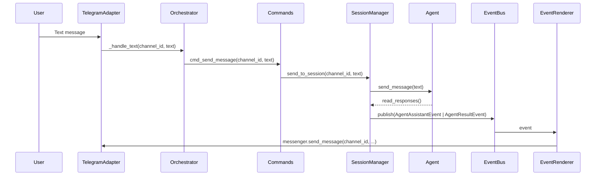
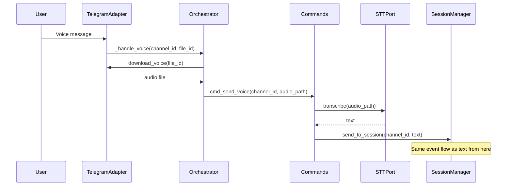
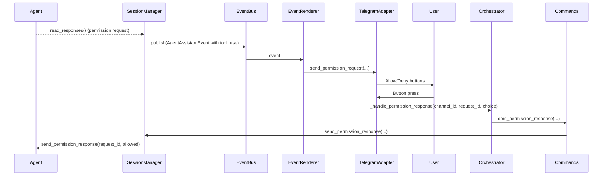
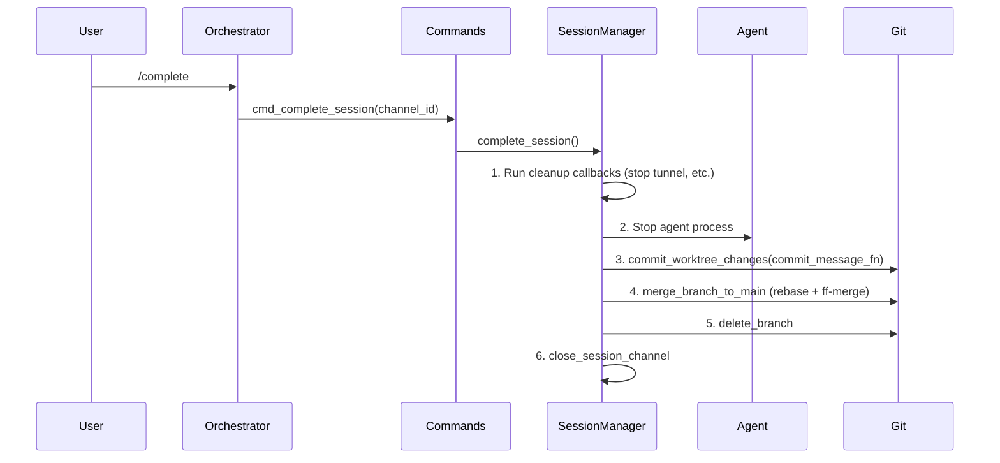

# AFK — Architecture

This document is for contributors who want to understand, modify, or extend the codebase.

## Design Decisions

### Why hexagonal architecture?

AFK needs to support multiple control planes (Telegram now, Slack/CLI/web later) and multiple agent runtimes (Claude Code now, Codex/Aider later). A hexagonal (port-adapter) pattern keeps the core logic independent from both, so adding a new control plane or agent is just implementing an interface — no core changes needed.

### Why EventBus instead of direct callbacks?

Early versions passed callbacks directly from SessionManager to the messenger. This created tight coupling — the session manager had to know about message formatting. The EventBus decouples producers (agent read loop) from consumers (Telegram renderer, web SSE, message store). Adding a new consumer means subscribing to events, not modifying the session manager.

### Why git worktrees for session isolation?

Each session needs its own working directory so multiple agents can work on the same project concurrently without file conflicts. Git worktrees provide isolation with shared history — branches can be independently merged back to main via `/complete`.

### Why a single Commands entry point?

All control planes (Telegram, web API) go through the same `Commands` class. This prevents logic duplication across control planes and makes it easy to test commands without any messenger dependency.

## Layer Structure

```
┌─────────────────────────────────────────────────┐
│  Adapters (external integrations)               │
│  ┌──────────┐ ┌──────────┐ ┌──────────────────┐│
│  │ Telegram  │ │   Web    │ │ Claude/Codex/DR  ││
│  │ Adapter   │ │  Server  │ │ Agent Adapters   ││
│  └────┬─────┘ └────┬─────┘ └───────┬──────────┘│
├───────┼────────────┼────────────────┼───────────┤
│  Ports│(Protocols) │                │           │
│  ┌────┴─────┐ ┌────┴─────┐ ┌───────┴──────┐   │
│  │ Control  │ │ Control  │ │   Agent      │   │
│  │PlanePort │ │PlanePort │ │   Port       │   │
│  └────┬─────┘ └────┬─────┘ └───────┬──────┘   │
├───────┼────────────┼────────────────┼───────────┤
│  Core │            │                │           │
│  ┌────┴────────────┴────────────────┴────────┐ │
│  │  Commands → SessionManager → EventBus     │ │
│  │            → GitWorktree                  │ │
│  └───────────────────────────────────────────┘ │
└─────────────────────────────────────────────────┘
```

**Boundary rules:**
1. `core/` never imports from `adapters/`, `capabilities/`, or any external tool
2. `ports/` contains only Protocol definitions — no implementations
3. `adapters/` contains all external integrations
4. `capabilities/` contains pluggable session-level features
5. `core.commands` is the single entry point for all control planes
6. All agent output flows as typed events through EventBus

## Module Structure

```
afk/
├── main.py                          # Entry point, component wiring, daemon startup/shutdown
├── ports/                           # Abstract interfaces (Protocol definitions only)
├── core/                            # Business logic (agent/messenger-independent)
│   ├── commands.py                  # Commands API — single entry point for all control planes
│   ├── events.py                    # EventBus (asyncio pub/sub) + typed event dataclasses
│   ├── orchestrator.py              # Thin glue: wires messenger callbacks to Commands API
│   ├── session_manager.py           # Session lifecycle (create, stop, complete, persist)
│   └── git_worktree.py              # Git worktree/branch operations
├── adapters/                        # Concrete implementations of ports
├── capabilities/                    # Pluggable session-level features
├── storage/
│   ├── project_store.py             # Project registration CRUD (JSON file)
│   └── message_store.py             # Per-session in-memory message history
└── data/                            # Runtime data (gitignored)
    ├── projects.json
    └── sessions.json
```

## Data Flow

### Text Prompt



### Voice Prompt



### Permission Handling



### Session Complete



## Session Lifecycle

```
/new MyApp
  → creates branch: afk/myapp-260218-143022
  → creates worktree: .afk-worktrees/myapp-260218-143022
  → creates Telegram forum topic
  → starts agent subprocess

[user sends prompts, agent works]

/complete
  → auto-commits uncommitted changes (commit message generated by Claude Code CLI)
  → rebases onto main + fast-forward merge
  → removes worktree and branch
  → deletes forum topic

/stop (alternative)
  → stops agent, removes worktree, no merge
```

Sessions survive daemon restarts — on startup, AFK recovers active sessions from `sessions.json` and resumes agent processes with their previous context. Orphan worktrees from crashed sessions are cleaned up automatically.

## Key Interfaces

### AgentPort

Any AI coding agent implements this protocol to be usable as a session runtime.

```python
class AgentPort(Protocol):
    async def start(self, working_dir: str, session_id: str | None = None) -> None: ...
    async def send_message(self, text: str) -> None: ...
    async def send_permission_response(self, request_id: str, allowed: bool) -> None: ...
    async def read_responses(self) -> AsyncIterator[dict]: ...
    async def stop(self) -> None: ...
```

### ControlPlanePort

Control planes (Telegram, web, CLI) implement this to provide session channels and messaging.

```python
class ControlPlanePort(Protocol):
    async def send_message(self, channel_id: str, text: str, *, silent: bool = False) -> str: ...
    async def create_session_channel(self, name: str) -> str: ...
    async def close_session_channel(self, channel_id: str) -> None: ...
    async def send_permission_request(self, channel_id: str, ...) -> None: ...
    async def start(self) -> None: ...
    async def stop(self) -> None: ...
```

### EventBus

Asyncio pub/sub. Publishers call `publish(event)`, subscribers iterate via `iter_events(EventType)`.

Event types: `AgentSystemEvent`, `AgentAssistantEvent`, `AgentResultEvent`, `AgentStoppedEvent`, `SessionCreatedEvent`, `FileReadyEvent`

## Wiring (`main.py`)

```python
event_bus = EventBus()
messenger = TelegramAdapter(telegram_config)

session_manager = SessionManager(
    messenger, data_dir,
    event_bus=event_bus,
    agent_factory=ClaudeCodeAgent,
    commit_message_fn=generate_commit_message,
)

tunnel_capability = TunnelCapability()
session_manager.add_cleanup_callback(tunnel_capability.cleanup_session)

commands = Commands(session_manager, project_store, message_store, stt=stt, tunnel=tunnel_capability)

renderer = EventRenderer(event_bus, messenger, message_store)
renderer.start()

orchestrator = Orchestrator(messenger, commands)
```

## Extending AFK

### Adding an Agent Runtime

Implement `AgentPort` and place it under `adapters/`:

```
adapters/
├── claude_code/agent.py     # Claude Code CLI (current)
├── codex/agent.py           # OpenAI Codex CLI (current)
├── deep_research/agent.py   # OpenAI Deep Research (current)
└── your_agent/agent.py      # Your new agent
```

### Adding a Control Plane

Implement `ControlPlanePort` and place it under `adapters/` or `messenger/`:

```
messenger/
├── telegram/                # Telegram forum topics (current)
└── slack/adapter.py         # e.g. Slack thread-based
```

### Adding a Capability

Capabilities are session-level plugins. Register cleanup with SessionManager:

```python
my_capability = MyCapability()
session_manager.add_cleanup_callback(my_capability.cleanup_session)
commands = Commands(..., my_capability=my_capability)
```

```
capabilities/
├── tunnel/tunnel.py         # Dev server tunneling (current)
└── your_feature/feature.py  # Your new capability
```
