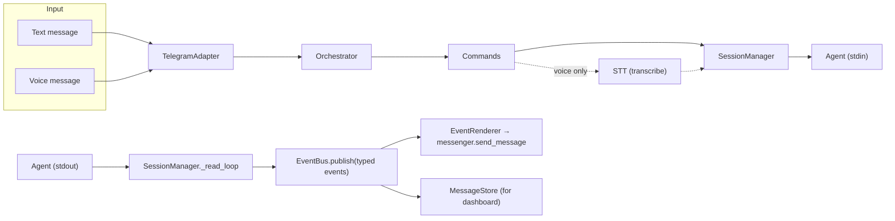

# CLAUDE.md

This file provides guidance to Claude Code (claude.ai/code) when working with code in this repository.

## Project Overview

AFK ("Away From Keyboard") is a Python daemon that serves as a remote control plane for AI coding agents. Users issue commands via Telegram (voice or text) from any device, while a local server runs coding sessions 24/7. See `PROJECT.md` for vision and `ARCH.md` for detailed architecture.

## Tech Stack

- **Python 3.11+** with **asyncio** (event-driven)
- **python-telegram-bot[ext]>=21.0** — Telegram Bot API (asyncio native)
- **aiohttp>=3.9** — web dashboard server
- **python-dotenv>=1.0** — environment variable loading
- **openai>=1.0** — Whisper API for voice transcription (optional, only if API key is set)
- **Claude Code CLI** — headless mode via `--input-format stream-json --output-format stream-json`
- **OpenAI Codex CLI** — non-interactive mode via `codex exec --json` (optional, selected via `AFK_AGENT=codex`)
- **cloudflared** — quick tunnels for remote verification (optional)
- **uv** — Python package manager (uv.lock)

## Architecture Boundary Rules

3-layer hexagonal (port-adapter) architecture. **These rules must be followed strictly:**

1. `core/` never imports from `adapters/`, `messenger/`, `capabilities/`, or any external tool (Telegram, Claude, cloudflared)
2. `ports/` contains only Protocol definitions — no implementations
3. `adapters/` contains all external integrations
4. `capabilities/` contains pluggable session-level features
5. `core.commands` is the single entry point for all control planes
6. All agent output flows as typed events through EventBus

## Data Flow

## Telegram Commands

- `/project add|list|remove` — register project names to local paths
- `/new <project_name> [-v|--verbose]` — create new session (worktree + branch + forum topic); `-v`/`--verbose` shows full tool input/output
- `/sessions` — list active sessions with state indicators
- `/stop` — stop current session's agent process and clean up worktree
- `/complete` — auto-commit worktree changes, merge into main, cleanup
- `/status` — check current session state (name, agent alive, project, worktree, tunnel URL)
- `/tunnel` — start dev server + cloudflared tunnel; `/tunnel stop` to stop
- Unknown commands display help with the list of available commands

## Environment Variables

- `AFK_TELEGRAM_BOT_TOKEN` (required) — Telegram bot token
- `AFK_TELEGRAM_GROUP_ID` (required) — Telegram group/supergroup ID
- `AFK_AGENT` (optional, default: `claude`) — agent runtime selection (`claude` or `codex`)
- `AFK_DASHBOARD_PORT` (optional, default: 7777) — web dashboard port
- `AFK_OPENAI_API_KEY` or `OPENAI_API_KEY` (optional) — enables voice message transcription via Whisper API

## Development Notes

- Session naming convention: `{project_name}-{YYMMDD-HHMMSS}` (e.g. `myapp-260218-143022`)
- Branch naming: `afk/{session_name}` (e.g. `afk/myapp-260218-143022`)
- Worktree directory: `.afk-worktrees/{session_name}`
- Each session runs in an isolated git worktree with its own branch
- `/complete` auto-commits uncommitted changes (commit message generated by Claude Code CLI `-p` mode via injected `commit_message_fn`), then rebases onto main + fast-forward merge
- Orphan worktrees from crashed sessions are cleaned up on daemon startup
- Telegram messages over 4096 chars are split at newline boundaries
- Silent notifications for assistant (log-like) messages, normal notifications for results/errors
- Deep-links use `https://t.me/c/{group_id}/{channel_id}` scheme
- Voice support is conditionally enabled only when OpenAI API key is configured
- Capabilities register cleanup callbacks with SessionManager — cleanup runs on `/stop` or `/complete`
