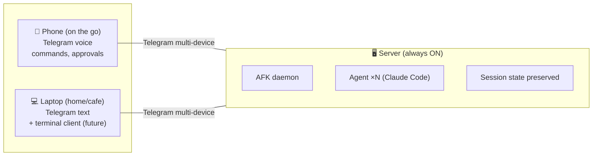

# AFK — Code while AFK.

A remote control plane for AI coding agents.
Issue commands, observe progress, and intervene — without sitting at a terminal.

> Developers, get off your ass.

## Target Users

**Solo entrepreneurs — especially vibe coders.**

They don't read source code themselves. They tell AI what to do, check the results, and move on.
They run multiple projects simultaneously, issue instructions from their phone, and only care whether the output works.

For these people, the terminal is a bottleneck. AFK removes that bottleneck.

## Core Principles

- **Input is voice, output is text**: Optimized for human I/O bandwidth
- **Messenger is the control plane**: Starting with Telegram (MVP), control from anywhere
- **Session = isolated workspace**: Session isolation, concurrent multitasking
- **Agent-agnostic**: AgentPort abstraction allows swapping Claude Code / Codex / any agent
- **Control-plane-agnostic**: ControlPlanePort abstraction allows swapping Telegram / Slack / CLI / native app
- **STT-agnostic**: STTPort abstraction allows swapping Whisper local / API / Deepgram
- **Always-on**: Runs as a daemon on any local machine, accessible from any device

## Deployment Architecture



The always-on machine serves as the server. Phone/laptop act as clients only.
Telegram natively supports multi-device, so no extra implementation needed for MVP.

**Daily scenario:**

```
[Morning, before heading out]
Phone voice: "Add payment feature to MyApp. Stripe integration, webhook handling"
→ Agent starts working on server

[Commuting]
Phone notification: ⚠️ Stripe API key is required
Phone voice: "Allow"
→ Agent continues working

[Arriving at cafe, open laptop]
Telegram: Check progress, /tunnel to verify results in browser

[Back home]
Terminal: afk attach → hands-on finishing touches (future)
```
