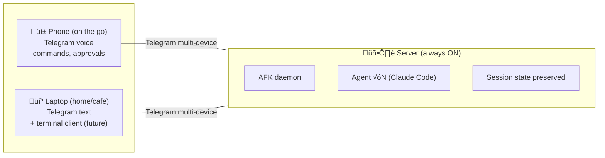

# AFK — Work while AFK.

A remote control plane for AI work sessions.
Issue commands, observe progress, and intervene — without sitting at a terminal.

> Get off your ass.

## Target Users

**Solo entrepreneurs, freelancers, one-person agencies — anyone who uses AI to produce real deliverables.**

They tell AI what to do, check the results, and move on.
They run multiple projects simultaneously, issue instructions from their phone, and only care whether the output works.

Whether it's code, blog posts, research reports, or data analysis — the deliverable is always **files in a workspace**.

For these people, the terminal is a bottleneck. AFK removes that bottleneck.

## Core Principles

- **File-based deliverables**: One path = one workspace = one project. All output is files — code, documents, reports, data
- **Input is voice, output is text**: Optimized for human I/O bandwidth
- **Messenger is the control plane**: Starting with Telegram (MVP), control from anywhere
- **Session = isolated workspace**: Session isolation, concurrent multitasking
- **Agent-agnostic**: AgentPort abstraction allows swapping Claude Code / Codex / any agent
- **Control-plane-agnostic**: ControlPlanePort abstraction allows swapping Telegram / Slack / CLI / native app
- **STT-agnostic**: STTPort abstraction allows swapping Whisper local / API / Deepgram
- **Always-on**: Runs as a daemon on any local machine, accessible from any device

## Deployment Architecture



The always-on machine serves as the server. Phone/laptop act as clients only.
Telegram natively supports multi-device, so no extra implementation needed for MVP.

**Daily scenarios:**

```
— Coding —
[Morning] Phone voice: "Add Stripe payment integration to MyApp"
→ Agent starts working on server
[Commuting] Phone notification: ⚠️ Permission needed → "Allow"
[Cafe] /tunnel to verify results in browser
[Home] /complete to merge into main

— Research —
[Morning] Phone voice: "Research competitor pricing for SaaS analytics tools.
                        Summarize in a comparison table with pros/cons"
→ Agent searches, analyzes, writes a structured markdown report
[Afternoon] Review the report, send follow-up: "Add a section on enterprise pricing"

— Writing —
[Evening] Phone voice: "Draft a blog post about our v2 launch.
                        Use the changelog from the last 2 weeks"
→ Agent reads git history, drafts a post in the workspace
[Next morning] Review, tweak, publish
```

## Workspace Types (Roadmap)

The current architecture (path → workspace → git worktree → agent session) generalizes naturally:

| Workspace Type | Agent | Deliverables |
|---|---|---|
| **Coding** (current) | Claude Code, Codex | Source code, tests, configs |
| **Writing** | Claude w/ file tools | Blog posts, proposals, documentation |
| **Research** | Claude w/ web search | Market analysis, competitor reports, summaries |
| **Data Analysis** | Claude w/ code execution | Charts, CSV transforms, report files |

All workspace types share the same core: a folder where files accumulate, tracked by git, managed through Telegram.

What's needed: workspace templates and capabilities — two ecosystem layers that make AFK extensible.

## Capabilities

Capabilities are session-level plugins that hook into the session lifecycle. Unlike general-purpose AI skills (e.g. "send an email"), AFK capabilities assist **file-based deliverable production** within a workspace.

### Design Principles

- Attach/detach per session — not global, not permanent
- Hook into session lifecycle events (start, agent response, complete, stop)
- Generalize the existing `add_cleanup_callback` pattern in SessionManager
- Each capability owns its own cleanup

### Built-in and Planned

```
capabilities/
├── tunnel/          # Current — dev server + cloudflared tunnel
├── test_runner/     # Auto-test on code change → feed failures back to agent
├── cost_guard/      # Pause session when budget cap reached
├── diff_reviewer/   # AI-generated change summary before /complete
├── auto_commit/     # Periodic commits to prevent work loss
├── screenshot/      # Web app screenshot → Telegram
├── deploy/          # One-click deploy (Vercel, Railway)
└── notify/          # External webhook (Slack, email) on session events
```

### Distribution

1. **Now**: built into the monorepo
2. **Later**: separate repos + registry, installable via `afk capability install <name>`

## Workspace Templates

Templates define what a workspace looks like when created with `/new`. This is AFK's unique ecosystem layer — it turns project setup into a shareable, community-driven format.

### What a Template Contains

- Default folder structure
- Agent runtime to use
- Capabilities to activate by default
- Agent context file (e.g. `CLAUDE.md` with domain instructions)
- Completion criteria (which files signal "done")

### Usage

```
/new MyApp --template nextjs        # Next.js project with tailored agent context
/new Report --template research     # Web search agent + markdown deliverables
/new BlogPost --template writing    # Writing-optimized workspace
```

### Why Community Contribution Works

- Low barrier: a template is just a config file + folder structure
- Naturally shareable: "I always start Next.js + Supabase projects like this" → template
- Composable: templates reference capabilities, not reimplement them

### Distribution

1. **Now**: built-in templates for core workspace types
2. **Later**: community template registry, installable via `afk template install <name>`

## Roadmap

### Phase 1: Daily-drivable (weeks)
- Agent crash auto-restart
- Telegram reconnection recovery
- Session state restore after daemon restart
- `afk init` interactive wizard
- Docker image
- Core unit tests (commands, session_manager, events)
- Better error messages

### Phase 2: Work-specific features (1-2 months)
- Multi-agent orchestration (cross-session coordination)
- Deliverable review automation (`diff_reviewer` capability)
- Cost management (`cost_guard` capability)
- Auto-test on code changes (`test_runner` capability)

### Phase 3: Workspace expansion + ecosystem (3-6 months)
- Writing / research / data analysis workspace types
- Workspace template system + built-in templates
- Agent runtime expansion (Aider, etc. via AgentPort adapters)
- Control plane expansion (Slack, Discord via ControlPlanePort)
- Capability plugin architecture + distribution

### Phase 4: Community ecosystem (stars 500+)
- Capability registry (`afk capability install <name>`)
- Template registry (`afk template install <name>`)
- Community-contributed capabilities and templates

## Non-goals

- General-purpose AI assistant (email, calendar, payments) — AFK produces file-based deliverables, not actions
- Custom LLM integration — AFK orchestrates existing agent runtimes, not replaces them
- Mobile app — Telegram already serves as the mobile client
- Premature feature expansion — Phase 1 must be solid before anything else matters
