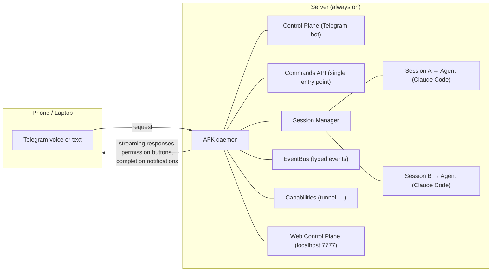

# AFK — Work while AFK

A remote control plane for AI work sessions. Issue commands via Telegram (voice or text) from any device, while a local server runs sessions 24/7 — coding, writing, research, and more.

## Why

Terminals are a bottleneck. You sit at a desk, type prompts, wait for responses, approve permissions — one session at a time, one screen at a time.

AFK breaks that loop:

- **Work from anywhere.** Send a voice message from your phone while commuting. The agent runs on your server back home.
- **Run multiple sessions.** Each Telegram forum topic is an isolated agent session. Start one for frontend, another for backend, check in when you want.
- **Stay in control without being present.** Permission requests arrive as push notifications with approve/deny buttons. No terminal window required.
- **See what's happening.** A built-in web control plane shows live session activity, message history, and daemon logs — all at `localhost:7777`.
- **Verify remotely.** Start a dev server tunnel with `/tunnel` and preview your app from your phone.

The target user is a solo entrepreneur, freelancer, or one-person agency who uses AI to produce real deliverables — code, documents, research reports. AFK makes that workflow mobile.

## How It Works



1. You send a message (text or voice) in a Telegram forum topic
2. AFK routes it through the Commands API to the agent subprocess tied to that topic
3. The agent streams responses back — published as events, rendered to Telegram silently
4. When the agent needs permission to run a tool, you get a notification with Allow/Deny buttons
5. On completion, you see cost and duration

## Prerequisites

| Requirement | Notes |
|---|---|
| **macOS or Linux** | Tested on Apple Silicon; Linux works for always-on servers |
| **Python 3.11+** | Check with `python3 --version` |
| **uv** | Python package manager ([install](https://docs.astral.sh/uv/getting-started/installation/)) |
| **Git** | `git --version` |
| **Claude Code CLI** | Must be installed and authenticated — see step 2 below |
| **Telegram account** | For the bot and supergroup setup |

## Setup from Scratch

### Step 1. Create Telegram Bot & Supergroup

**Create a bot:**

1. Open Telegram and message [@BotFather](https://t.me/BotFather)
2. Send `/newbot`, follow the prompts to name your bot
3. Copy the **bot token** (looks like `7349288428:AAF32REWFK55Ygt_...`)

**Create a supergroup with Topics:**

1. Create a new Telegram group (any name — e.g. "AFK Workspace")
2. Go to Group Settings → scroll down → enable **Topics** (forum mode)
3. Add your bot to the group as **admin** with these permissions:
   - Manage Topics
   - Send Messages
   - Edit Messages
   - Delete Messages

**Get the group ID:**

1. Add [@raw_data_bot](https://t.me/raw_data_bot) to the group temporarily
2. It will print the **chat ID** — a negative number like `-1001234567890`
3. Save this number, then remove the bot from the group

### Step 2. Install Claude Code CLI

AFK uses Claude Code as the default agent runtime. Install and authenticate it:

```bash
# Install
npm install -g @anthropic-ai/claude-code

# Authenticate (opens browser)
claude

# Verify
claude --version
```

Make sure `claude` is available in your PATH. AFK launches it in headless mode (`--input-format stream-json --output-format stream-json`) per session.

### Step 3. Install AFK

Choose one of the two options below:

#### Option A. Quick Install (Automated)

```bash
bash <(curl -fsSL https://raw.githubusercontent.com/Donghh0221/afk/main/install.sh)
```

The script checks prerequisites, clones the repo, installs dependencies, creates `.env` (prompts for the bot token and group ID from Step 1), and optionally sets up a launchd daemon. After it finishes, skip to **Step 4. Run**.

#### Option B. Manual Install

```bash
git clone https://github.com/Donghh0221/afk.git
cd afk

# Install dependencies with uv
uv sync
```

If you don't have `uv`:

```bash
# Install uv first
curl -LsSf https://astral.sh/uv/install.sh | sh

# Or use pip instead
pip install -e .
```

Then create the `.env` file:

```bash
cp .env.example .env
```

Edit `.env` and set the required values:

```bash
# Required
AFK_TELEGRAM_BOT_TOKEN="your-bot-token-here"
AFK_TELEGRAM_GROUP_ID="-100xxxxxxxxxx"

# Optional — enables voice messages (Whisper) and Deep Research agent
# AFK_OPENAI_API_KEY="sk-..."

# Optional — auto-resolve project paths with /new
# AFK_BASE_PATH="~/workspace"

# Optional — web dashboard port (default: 7777)
# AFK_DASHBOARD_PORT="7777"

# Optional — default agent runtime: claude (default), codex, or deep-research
# AFK_AGENT="claude"
```

### Step 4. Run

```bash
uv run afk
```

You should see:

```
AFK is running. Press Ctrl+C to stop.
Web control plane running at http://localhost:7777
```

AFK is now listening for Telegram messages and serving the web dashboard.

### Step 5. Verify

1. Open Telegram → go to your supergroup
2. Send `/project add ~/projects/myapp MyApp` (register a project)
3. Send `/new MyApp` — a new forum topic is created with an active agent session
4. Switch to the new topic and type a prompt — the agent should respond

## Usage

All interaction happens in your Telegram supergroup.

### Start a Session

The simplest way — set `AFK_BASE_PATH` and skip manual project registration:

```
/new myapp                        # Start from $AFK_BASE_PATH/myapp
/new myapp -v                     # Verbose — show full tool input/output
/new myapp --agent codex          # Use Codex for this session only
/new myapp --agent deep-research  # Use OpenAI Deep Research
/new myapp --template nextjs      # Apply workspace template
```

What happens with `/new`:
1. If `myapp` is already a registered project → use it
2. If `$AFK_BASE_PATH/myapp` exists → auto-register and start (runs `git init` if needed)
3. If the directory doesn't exist → create it + `git init` + start

To manage projects manually:

```
/project add ~/projects/myapp myapp
/project list
/project remove myapp
```

Each `/new` creates a forum topic (e.g. `myapp-260218-143022`) with an isolated git worktree and starts an agent subprocess.

### Send Prompts

Switch to the session topic and type (or voice-message) your instructions:

```
Add Stripe payment integration with webhook handling
```

The agent works on it. You'll see streaming tool calls and responses. When it's done:

```
✅ Done ($0.0523, 12.3s)
```

### Verify Remotely

Start a dev server tunnel from the session topic:

```
/tunnel                # Auto-detect dev server and expose via cloudflared
/tunnel stop           # Stop the tunnel
```

Requires [cloudflared](https://developers.cloudflare.com/cloudflare-one/connections/connect-networks/downloads/) to be installed.

### Manage Sessions

```
/sessions          # List all active sessions (General topic)
/status            # Check current session state (session topic)
/stop              # Stop current session and remove worktree (session topic)
/complete          # Commit, merge branch into main, clean up (session topic)
```

### Workspace Templates

Templates provide pre-configured scaffolds and agent context for different work types:

```
/template list                     # List available templates
/new myapp --template nextjs       # Next.js 15 project scaffold
/new myapp --template research     # Research report scaffold
/new myapp --template writing      # Writing/content scaffold
/new myapp --template coding       # Generic coding scaffold
```

## Web Control Plane

Open `http://localhost:7777` in a browser to:

- Create and manage sessions
- Send prompts and approve permissions
- View per-session message history and daemon logs
- Stream live agent events via SSE

The web CP also provides a REST API:

```
GET  /api/sessions                              # List sessions
POST /api/sessions                              # Create session
GET  /api/sessions/{channel_id}/status          # Session status
GET  /api/sessions/{channel_id}/messages        # Message history
POST /api/sessions/{channel_id}/message         # Send text
POST /api/sessions/{channel_id}/stop            # Stop session
POST /api/sessions/{channel_id}/complete        # Complete & merge
POST /api/sessions/{channel_id}/permission      # Permission response
GET  /api/sessions/{channel_id}/files/{name}    # Download session file
GET  /api/events                                # SSE event stream
GET  /api/projects                              # List projects
POST /api/projects                              # Add project
DELETE /api/projects/{name}                     # Remove project
GET  /api/logs                                  # Daemon log tail
```

## Environment Variables

| Variable | Required | Default | Description |
|---|---|---|---|
| `AFK_TELEGRAM_BOT_TOKEN` | Yes | — | Telegram bot token from @BotFather |
| `AFK_TELEGRAM_GROUP_ID` | Yes | — | Supergroup chat ID (negative number) |
| `AFK_OPENAI_API_KEY` | No | — | Enables voice transcription (Whisper) and Deep Research agent. Also reads `OPENAI_API_KEY` |
| `AFK_AGENT` | No | `claude` | Default agent runtime: `claude`, `codex`, or `deep-research` |
| `AFK_BASE_PATH` | No | — | Base directory for smart `/new` auto-resolution |
| `AFK_DASHBOARD_PORT` | No | `7777` | Web control plane port |
| `AFK_DEEP_RESEARCH_MODEL` | No | `o4-mini-deep-research` | OpenAI Deep Research model |
| `AFK_DEEP_RESEARCH_MAX_TOOL_CALLS` | No | — | Max tool calls for Deep Research cost control |

## Running as a Daemon

### macOS (launchd)

The install script can set this up automatically (`bash install.sh`), or manually:

```bash
# Create plist
cat > ~/Library/LaunchAgents/com.afk.daemon.plist << 'EOF'
<?xml version="1.0" encoding="UTF-8"?>
<!DOCTYPE plist PUBLIC "-//Apple//DTD PLIST 1.0//EN"
  "http://www.apple.com/DTDs/PropertyList-1.0.dtd">
<plist version="1.0">
<dict>
    <key>Label</key>
    <string>com.afk.daemon</string>
    <key>ProgramArguments</key>
    <array>
        <string>/path/to/uv</string>
        <string>run</string>
        <string>afk</string>
    </array>
    <key>WorkingDirectory</key>
    <string>/path/to/afk</string>
    <key>RunAtLoad</key>
    <true/>
    <key>KeepAlive</key>
    <true/>
    <key>StandardOutPath</key>
    <string>/tmp/afk.out.log</string>
    <key>StandardErrorPath</key>
    <string>/tmp/afk.err.log</string>
</dict>
</plist>
EOF

# Update paths in the plist, then:
launchctl load ~/Library/LaunchAgents/com.afk.daemon.plist
```

Manage the daemon:

```bash
launchctl load   ~/Library/LaunchAgents/com.afk.daemon.plist  # Start
launchctl unload ~/Library/LaunchAgents/com.afk.daemon.plist  # Stop
tail -f /tmp/afk.out.log /tmp/afk.err.log                    # Logs
```

### Linux (systemd)

```bash
cat > ~/.config/systemd/user/afk.service << 'EOF'
[Unit]
Description=AFK Daemon
After=network.target

[Service]
Type=simple
WorkingDirectory=/path/to/afk
ExecStart=/path/to/uv run afk
Restart=always
RestartSec=5
EnvironmentFile=/path/to/afk/.env

[Install]
WantedBy=default.target
EOF

systemctl --user daemon-reload
systemctl --user enable --now afk
journalctl --user -u afk -f    # Logs
```

## Session Lifecycle

Each session follows this lifecycle:

```
/new MyApp
  → creates branch: afk/myapp-260218-143022
  → creates worktree: .afk-worktrees/myapp-260218-143022
  → creates Telegram forum topic
  → starts agent subprocess

[user sends prompts, agent works]

/complete
  → auto-commits uncommitted changes
  → rebases onto main + fast-forward merge
  → removes worktree and branch
  → deletes forum topic

/stop (alternative)
  → stops agent, removes worktree, no merge
```

Sessions survive daemon restarts — on startup, AFK recovers active sessions from `sessions.json` and resumes agent processes with their previous context.

## Architecture

3-layer hexagonal architecture with pluggable ports and adapters:

```
┌─────────────────────────────────────────────────┐
│  Adapters                                       │
│  ┌──────────┐ ┌──────────┐ ┌──────────────────┐│
│  │ Telegram  │ │   Web    │ │ Claude/Codex/DR  ││
│  │ Adapter   │ │  Server  │ │ Agent Adapters   ││
│  └────┬─────┘ └────┬─────┘ └───────┬──────────┘│
├───────┼────────────┼────────────────┼───────────┤
│  Ports│(Protocols) │                │           │
│  ┌────┴─────┐ ┌────┴─────┐ ┌───────┴──────┐   │
│  │ Control  │ │ Control  │ │   Agent      │   │
│  │PlanePort │ │PlanePort │ │   Port       │   │
│  └────┬─────┘ └────┬─────┘ └───────┬──────┘   │
├───────┼────────────┼────────────────┼───────────┤
│  Core │            │                │           │
│  ┌────┴────────────┴────────────────┴────────┐ │
│  │  Commands → SessionManager → EventBus     │ │
│  │            → GitWorktree                  │ │
│  └───────────────────────────────────────────┘ │
└─────────────────────────────────────────────────┘
```

See [ARCH.md](ARCH.md) for the full architecture deep dive and [PROJECT.md](PROJECT.md) for vision and roadmap.

## Development

```bash
# Install with test dependencies
uv sync --extra test

# Run tests
uv run pytest

# Run a specific test
uv run pytest tests/test_session_manager.py -v

# Run the daemon in development
uv run afk
```

## License

MIT
