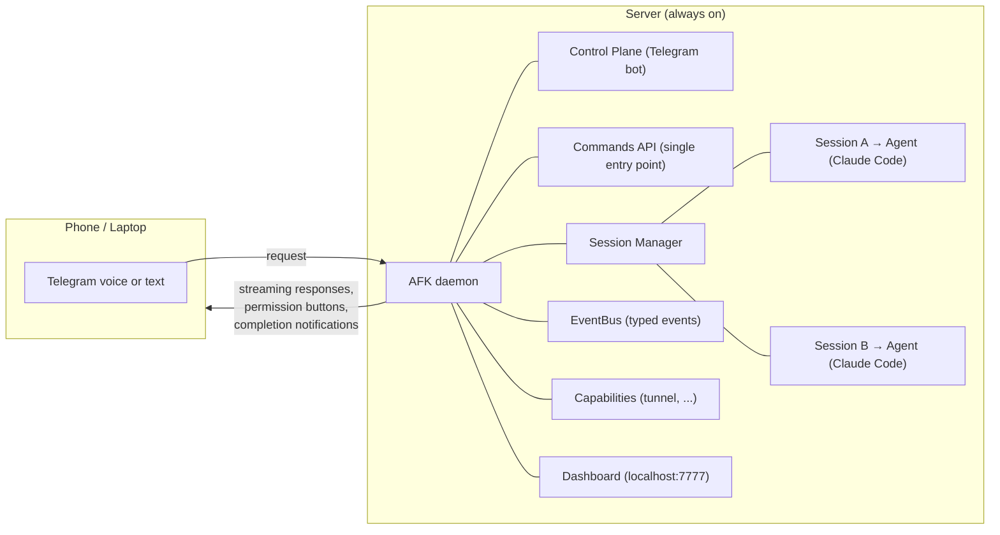

# AFK — Code while AFK

A remote control plane for AI coding agents. Issue commands via Telegram (voice or text) from any device, while a local server runs coding sessions 24/7.

## Why

Terminals are a bottleneck. You sit at a desk, type prompts, wait for responses, approve permissions — one session at a time, one screen at a time.

AFK breaks that loop:

- **Work from anywhere.** Send a voice message from your phone while commuting. The agent runs on your server back home.
- **Run multiple sessions.** Each Telegram forum topic is an isolated agent session. Start one for frontend, another for backend, check in when you want.
- **Stay in control without being present.** Permission requests arrive as push notifications with approve/deny buttons. No terminal window required.
- **See what's happening.** A built-in web dashboard shows live session activity, message history, and daemon logs — all at `localhost:7777`.
- **Verify remotely.** Start a dev server tunnel with `/tunnel` and preview your app from your phone.

The target user is a solo entrepreneur or vibe coder who tells AI what to build, checks results, and moves on. AFK makes that workflow mobile.

## How It Works



1. You send a message (text or voice) in a Telegram forum topic
2. AFK routes it through the Commands API to the agent subprocess tied to that topic
3. The agent streams responses back — published as events, rendered to Telegram silently
4. When the agent needs permission to run a tool, you get a notification with Allow/Deny buttons
5. On completion, you see cost and duration

## Prerequisites

- **macOS** (tested on Apple Silicon)
- **Python 3.11+**
- **Claude Code CLI** installed and authenticated (`claude` must be in PATH)
- **Telegram Bot** — create one via [@BotFather](https://t.me/BotFather)
- **Telegram Supergroup** with Topics (forum mode) enabled, bot added as admin

## Setup

### 1. Create Telegram Bot & Group

1. Message [@BotFather](https://t.me/BotFather) on Telegram → `/newbot` → save the **bot token**
2. Create a new Telegram group
3. Convert it to a supergroup: Group Settings → scroll down → "Topics" → enable
4. Add your bot to the group as **admin** (needs permissions: manage topics, send messages)
5. Get the **group ID**: add [@raw_data_bot](https://t.me/raw_data_bot) to the group, it will print the chat ID (negative number)

### 2. Install AFK

```bash
git clone <repo-url> && cd afk

# Using uv (recommended)
uv sync

# Or using pip
pip install -e .
```

### 3. Configure Environment

Create a `.env` file or export these variables:

```bash
export AFK_TELEGRAM_BOT_TOKEN="your-bot-token-here"
export AFK_TELEGRAM_GROUP_ID="-100xxxxxxxxxx"
# Optional
export AFK_DASHBOARD_PORT="7777"
export AFK_OPENAI_API_KEY="sk-..."  # Enables voice message transcription
```

### 4. Run

```bash
# With uv
uv run afk

# Or directly
python -m afk.main
```

AFK starts the Telegram bot and the dashboard server. You'll see:

```
AFK is running. Press Ctrl+C to stop.
Dashboard running at http://localhost:7777
```

### 5. Run as a Daemon (optional)

To keep AFK running 24/7, set up a launchd plist (macOS) or systemd service (Linux):

```bash
# macOS example — see install.sh for automated setup
launchctl load ~/Library/LaunchAgents/com.afk.daemon.plist
```

## Usage

All interaction happens in your Telegram supergroup.

### Register a Project

In the **General** topic:

```
/project add ~/projects/myapp MyApp
/project list
/project remove MyApp
```

### Start a Session

In the **General** topic:

```
/new MyApp
/new MyApp -v          # verbose mode — shows full tool input/output
```

This creates a new forum topic (`myapp-260218-143022`) with an isolated git worktree and starts an agent subprocess.

### Send Prompts

Switch to the session topic and type (or voice-message) your instructions:

```
Add Stripe payment integration with webhook handling
```

The agent works on it. You'll see streaming tool calls and responses. When it's done:

```
✅ Done ($0.0523, 12.3s)
```

### Verify Remotely

Start a dev server tunnel from the session topic:

```
/tunnel                # auto-detect dev server and expose via cloudflared
/tunnel stop           # stop the tunnel
```

### Manage Sessions

```
/sessions          # List all active sessions (General topic)
/status            # Check current session state (session topic)
/stop              # Stop current session (session topic)
/complete          # Merge branch into main and clean up (session topic)
```

### Dashboard

Open `http://localhost:7777` in a browser to see:

- Active sessions with live state indicators
- Per-session message history (user prompts, assistant responses, tool calls)
- Daemon log viewer

## Architecture

3-layer hexagonal architecture with pluggable ports and adapters. See [ARCH.md](ARCH.md) for details.
